# Database ER Diagram

```mermaid
erDiagram
    %% ==========================================
    %% Core: Listings
    %% ==========================================

    listings {
        bigint id PK
        text identity_key UK
        text name
        text normalized_name
        text address
        text layout
        real area_m2
        integer built_year
        integer floor_position
        integer floor_total
        integer total_units
        text station_line
        integer walk_min
        text property_type
        integer duplicate_count
        real latitude
        real longitude
        boolean is_active
        timestamptz created_at
        timestamptz updated_at
    }

    listing_sources {
        bigint id PK
        bigint listing_id FK
        text source
        text url UK
        integer price_man
        integer management_fee
        integer repair_reserve_fund
        text listing_agent
        boolean is_motodzuke
        boolean is_active
        timestamptz first_seen_at
        timestamptz last_seen_at
    }

    enrichments {
        bigint listing_id PK,FK
        integer listing_score
        integer price_fairness_score
        integer ai_recommendation_score
        text investment_summary
        text highlight_badge
        jsonb extracted_features
        jsonb image_categories
        real dedup_confidence
        jsonb dedup_candidates
        jsonb hazard_info
        jsonb commute_info
        text ss_lookup_status
        integer ai_listing_score
        integer ai_price_fairness_score
        text ai_model
        timestamptz ai_calculated_at
    }

    price_history {
        bigint id PK
        bigint listing_id FK
        text source
        integer price_man
        timestamptz recorded_at
    }

    listing_events {
        bigint id PK
        bigint listing_id FK
        text event_type
        text old_value
        text new_value
        timestamptz occurred_at
    }

    listings ||--o{ listing_sources : "has sources"
    listings ||--o| enrichments : "has enrichment"
    listings ||--o{ price_history : "price tracked"
    listings ||--o{ listing_events : "events logged"

    %% ==========================================
    %% User Domain
    %% ==========================================

    buyer_profiles {
        bigint id PK
        text user_id UK
        text family_composition
        text household_income
        text work_style
        jsonb preferred_areas
        jsonb must_have_features
        timestamptz updated_at
    }

    buyer_preference_summaries {
        bigint id PK
        text user_id UK
        text[] summary_lines
        integer liked_count
        integer noped_count
        text preference_hash
        text ai_model
        timestamptz ai_calculated_at
    }

    buyer_daily_briefs {
        integer id PK
        text user_id
        date brief_date
        text summary_text
        jsonb recommended_listings
        text ai_model
        timestamptz created_at
    }

    user_annotations {
        bigint id PK
        text user_id
        text listing_identity_key
        boolean is_liked
        text memo
        jsonb comments
        jsonb checklist
        jsonb photos
        timestamptz viewed_at
    }

    user_building_preferences {
        bigint id PK
        text identity_key
        text preference
        timestamptz created_at
    }

    %% ==========================================
    %% Market Data (Transactions)
    %% ==========================================

    transactions {
        text id PK
        text prefecture
        text ward
        text district
        integer price_man
        real area_m2
        integer m2_price
        text layout
        integer built_year
        text trade_period
        text building_group_id FK
        text estimated_building_name
    }

    building_groups {
        text group_id PK
        text prefecture
        text ward
        text district
        integer built_year
        integer transaction_count
        jsonb price_range_man
        integer avg_m2_price
        text estimated_building_name
    }

    transaction_metadata {
        text id PK
        timestamptz updated_at
        jsonb periods_covered
        integer transaction_count
        integer building_group_count
    }

    transactions }o--o| building_groups : "grouped into"

    %% ==========================================
    %% Pipeline Management
    %% ==========================================

    ai_prompts {
        integer id PK
        text module UK
        integer version
        boolean is_active
        text system_prompt
        text prompt_hash
        jsonb config
    }

    health_check_logs {
        bigint id PK
        date check_date
        jsonb coverage
        jsonb freshness
        jsonb data_quality
        jsonb anomalies
        integer alert_count
        jsonb alerts
    }

    pipeline_issues {
        bigint id PK
        text issue_key UK
        text severity
        text category
        text title
        text description
        text suggested_fix
        text fix_type
        text status
        integer detection_count
        timestamptz first_detected_at
        timestamptz resolved_at
    }

    notification_drafts {
        bigint id PK
        text channel
        text notification_type
        date draft_date
        text message_text
        text status
        timestamptz sent_at
    }

    notification_state {
        text id PK
        timestamptz last_notified_at
    }

    scraping_config {
        text id PK
        jsonb config
        timestamptz updated_at
    }

    %% ==========================================
    %% Commute & Misc
    %% ==========================================

    station_commute_times {
        integer id PK
        text station_name
        text office
        text scenario
        integer duration_min
        integer transfers
        text route_summary
        text source
    }

    near_misses {
        bigint id PK
        text identity_key
        text name
        text source
        integer price_man
        text reasons
        timestamptz detected_at
    }

    %% ==========================================
    %% View
    %% ==========================================

    listings_feed {
        bigint id
        text name
        integer price_man
        text source
        text url
        integer listing_score
    }
```

## View Definitions

| View | Definition |
|------|-----------|
| `listings_feed` | `listings` LEFT JOIN LATERAL `listing_sources` (active, LIMIT 1) LEFT JOIN `enrichments` |
| `listing_facts` | Buyer-facing listing facts view |

## Logical Relationships (no FK constraint)

| From | To | Via |
|------|----|----|
| `user_annotations` | `listings` | `listing_identity_key` = `listings.identity_key` |
| `user_building_preferences` | `listings` | `identity_key` (building-level key) |
| `near_misses` | `listings` | `identity_key` |
| `transactions.building_group_id` | `building_groups.group_id` | Logical FK |
